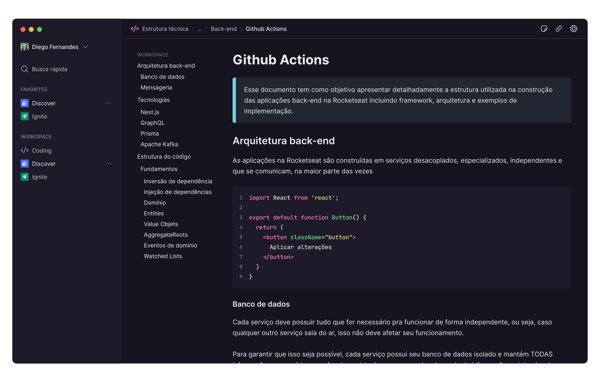

<h1 align="center">
  
</h1> 

<h2 align="center">Link to download: <a href="https://github.com/diaspd/rotion/releases/tag/untagged-c3795467c17cd0f0e736" target="_blank">Rotion</a> </h2>

<div align="center">
  <b>
    <a href="#-Technologies"><b>Technologies</b></a>&nbsp;&nbsp;&nbsp;|&nbsp;&nbsp;&nbsp;
    <a href="#-Project"><b>Project</b></a>&nbsp;&nbsp;&nbsp;|&nbsp;&nbsp;&nbsp;
    <a href="#-Layout"><b>Layout</b></a>&nbsp;&nbsp;&nbsp;
  </b>  
</div>

---

<div align="center">
  
</div> 

</br>

## 🚀 Getting started

Clone the project and access the folder.

```bash
$ git clone https://github.com/diaspd/rotion.git
$ cd 
```

## Installation

```bash
$ npm install
```

## Running the app

```bash
$ npm run dev
```

</br>

The app will be available on `http`

<br></br>

## 💻 Technologies

This project was developed with the following technologies:
<b>
  
</b>

</br>

## 📄 Project
💰 .

<br></br>

## 🔖 Layout
- [Rotion - Figma](https://www.figma.com/file/oDWCeuEWPkoSJytDBuTax5/Rotion-(Curso-de-Electron)?type=design&node-id=202-158&t=vW09l5F51Nm8uokw-0)

<br></br>

Made with ♥ by Pedro Dias. 👋 Follow me on social media! </br>

If you can give a little star, I appreciate it 🤩
